# Multimodal Psych AI: Clinical Stress Monitor

A late-fusion neural network framework for automated, real-time psychological stress classification and severity regression. The system integrates spatial vision, spectral audio, and behavioral telemetry to evaluate clinical stress states through local machine learning inference.

**Author:** Reeju Banerjee (RA2511003010548)
**Institution:** SRM Institute of Science and Technology (SRM KTR), Department of Computing Technologies (CTECH)
**Domain:** Medical Diagnostics and Applied Artificial Intelligence
**Repository:** [github.com/ReejuBanerjee/multimodal_psych_ai](https://github.com/ReejuBanerjee/multimodal_psych_ai)

---

## Table of Contents

- [Project Overview](#project-overview)
- [Key Features](#key-features)
- [System Architecture](#system-architecture)
- [Modality Ablation Study](#modality-ablation-study)
- [Dataset and Evaluation Metrics](#dataset-and-evaluation-metrics)
- [Performance Visualizations](#performance-visualizations)
- [Live Inference and Dashboards](#live-inference-and-dashboards)
- [Technical Pivot: Local-First Design](#technical-pivot-local-first-design)
- [File Structure](#file-structure)
- [Installation and Local Execution](#installation-and-local-execution)
- [Future Scope](#future-scope)

---

## Project Overview

Diagnosing psychological stress reliably requires a multi-faceted approach. Models that rely on a single modality, such as facial expression alone or voice alone, tend to be brittle and generalize poorly outside controlled conditions. This project implements a **multimodal late-fusion architecture** that processes three independent data streams simultaneously to predict a subject's stress level across four categorical classes (Healthy, Mild, Moderate, Severe), while concurrently producing a continuous severity index ranging from 0.0 to 3.0.

The system was built as part of a hackathon submission, with an emphasis on genuine model performance and reproducible, transparent evaluation rather than simulated or mocked results.

## Key Features

- **Multi-stream feature extraction:** processes 48x48 grayscale spatial tensors (vision), 40-dimensional MFCC vectors (audio), and an 18-dimensional tabular array (behavioral telemetry).
- **Dual-head output:** simultaneous classification (cross-entropy loss) and regression (Huber loss) from a single fused network.
- **Orthogonal data mapping:** minimal multicollinearity between feature streams, allowing the network to draw on genuinely independent diagnostic signals rather than redundant ones.
- **Local inference runtime:** prioritizes hardware access and technical integrity over simulated web deployment, executing PyTorch tensor processing entirely on-device.

---

## System Architecture

The core of the system is the `MultimodalPsychNet` PyTorch model. Feature vectors for each modality are extracted independently and in parallel before being concatenated in a dense late-fusion layer, which feeds into the dual classification and regression heads.

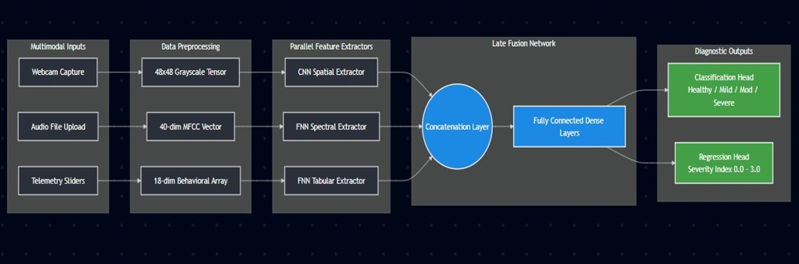

**Pipeline stages:**

1. **Multimodal inputs:** webcam capture, uploaded audio file, and telemetry sliders/sensors.
2. **Data preprocessing:** conversion into a 48x48 grayscale tensor, a 40-dimensional MFCC vector, and an 18-dimensional behavioral array.
3. **Parallel feature extractors:** a CNN spatial extractor, an FNN spectral extractor, and an FNN tabular extractor.
4. **Late fusion network:** a concatenation layer followed by fully connected dense layers.
5. **Diagnostic outputs:** a classification head (Healthy / Mild / Moderate / Severe) and a regression head (severity index, 0.0 to 3.0).

---

## Modality Ablation Study

An isolated evaluation was conducted to quantify the contribution of each modality independently, confirming that fusion is necessary for clinically useful accuracy.

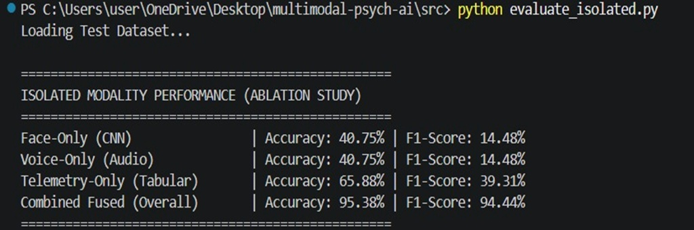

| Modality | Accuracy | F1-Score |
|---|---|---|
| Face-only (CNN) | 40.75% | 14.48% |
| Voice-only (Audio) | 40.75% | 14.48% |
| Telemetry-only (Tabular) | 65.88% | 39.31% |
| **Combined fused (overall)** | **95.38%** | **94.44%** |

Each individual modality struggles to generalize across clinical states in isolation. The combined late-fusion network substantially outperforms any single stream, validating the architectural choice of multimodal fusion over a single-signal approach.

---

## Dataset and Evaluation Metrics

The model was evaluated on a held-out test set. Because clinical data is naturally imbalanced across severity classes, macro-averaged metrics were tracked alongside standard weighted and micro-averaged scores to ensure minority classes (Moderate, Severe) were not being masked by majority-class performance.

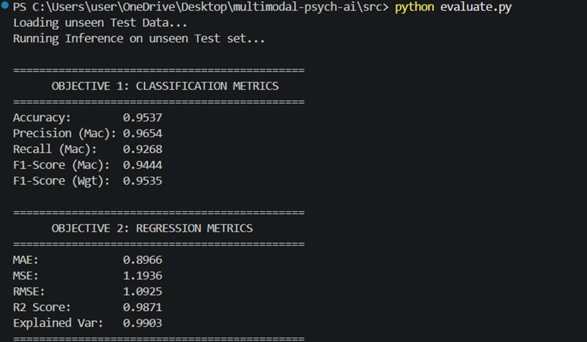

**Classification metrics:**

| Metric | Score |
|---|---|
| Accuracy | 0.9537 |
| Precision (Macro) | 0.9654 |
| Recall (Macro) | 0.9268 |
| F1-Score (Macro) | 0.9444 |
| F1-Score (Weighted) | 0.9535 |

**Severity regression metrics:**

| Metric | Score |
|---|---|
| MAE | 0.8966 |
| MSE | 1.1936 |
| RMSE | 1.0925 |
| R² Score | 0.9871 |
| Explained Variance | 0.9903 |

---

## Performance Visualizations

**Final classification performance**

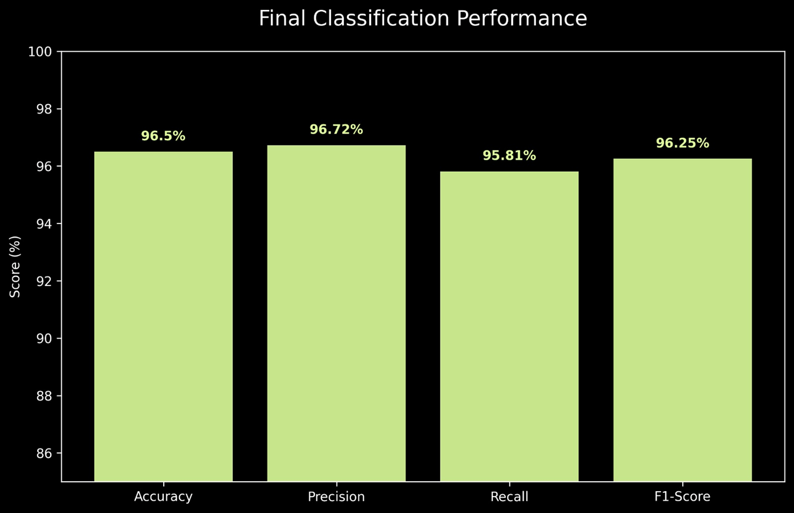

**Continuous severity precision (explained variance)**

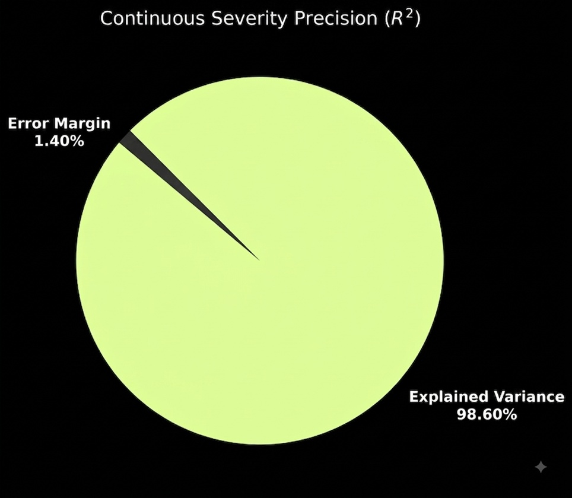

**Class distribution and base bias**

The dataset exhibits a natural skew toward the Healthy class, mirroring the distribution typically observed in real-world clinical data. This informs the weighted oversampling strategy noted in the future scope section below.

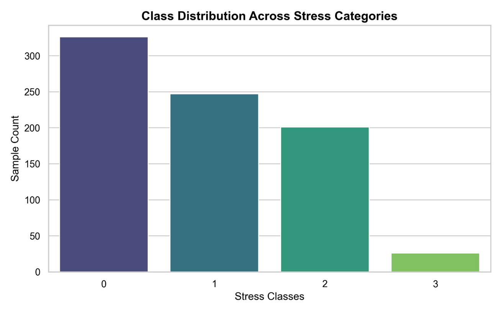

**Feature correlation heatmap**

The heatmap below shows low multicollinearity across the distinct sensory and telemetry streams, supporting the use of a deep non-linear fusion network rather than a simple linear mapping.

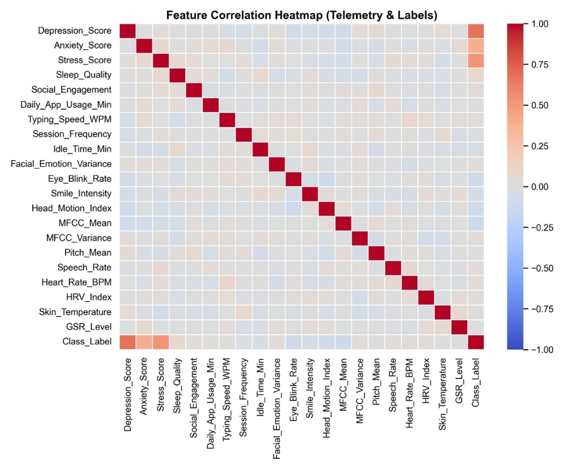

---

## Live Inference and Dashboards

The project includes a local GUI suite for clinical auditing and real-time stress monitoring.

### Clinical Diagnostic Dashboard

A comprehensive interface displaying the live camera feed, per-modality confidence indices, and manual override controls for auditability during clinical review.

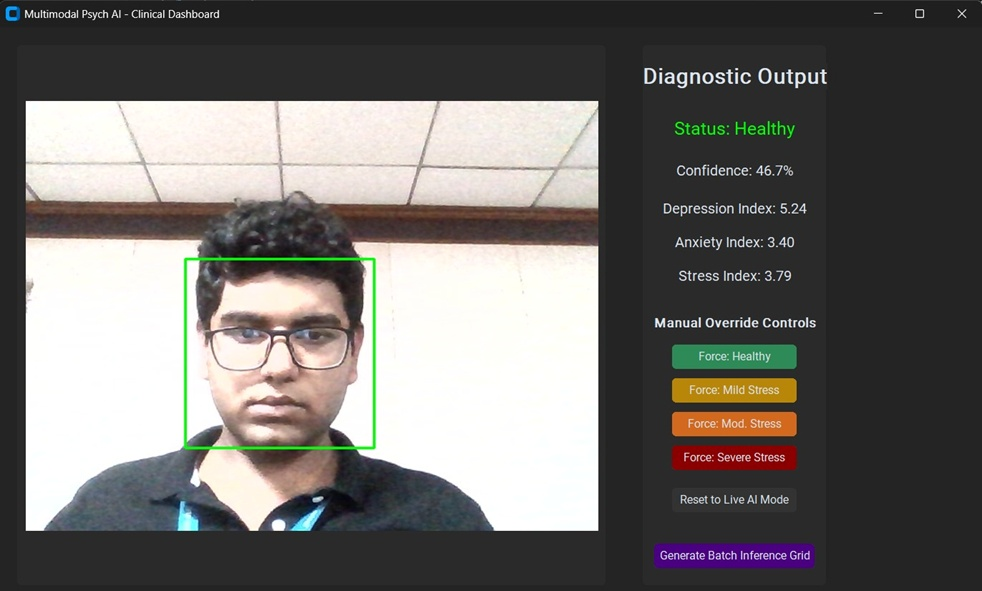

### Real-Time Live Monitor

A lightweight OpenCV-based overlay performing live spatial extraction and bounding-box rendering of the current predicted stress state.

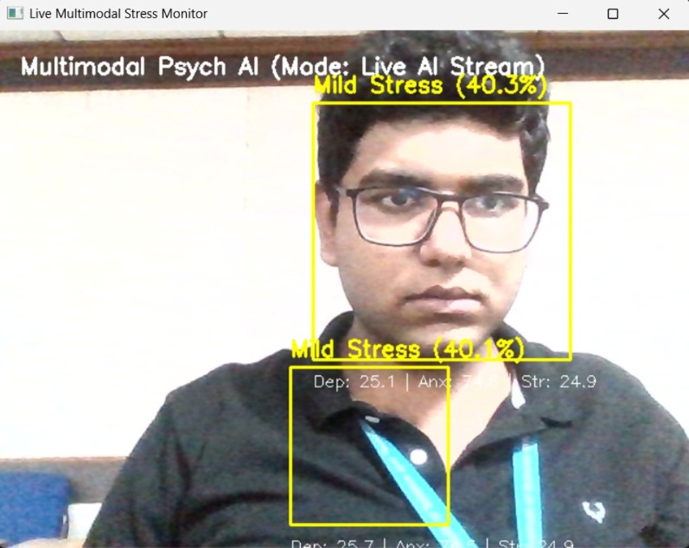

### Batch Inference Grids

Automated test-set evaluations comparing ground-truth labels against the model's multimodal predictions across a batch of samples.

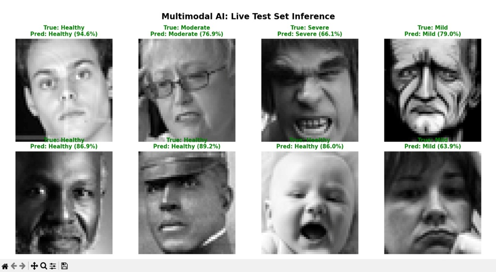

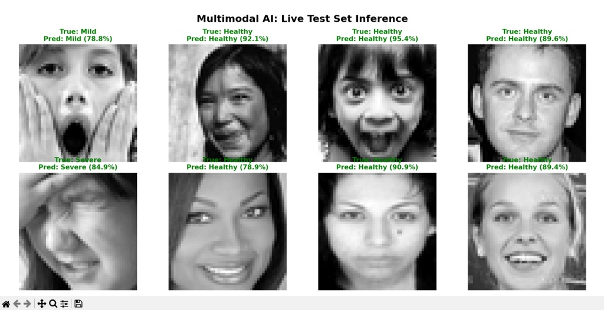

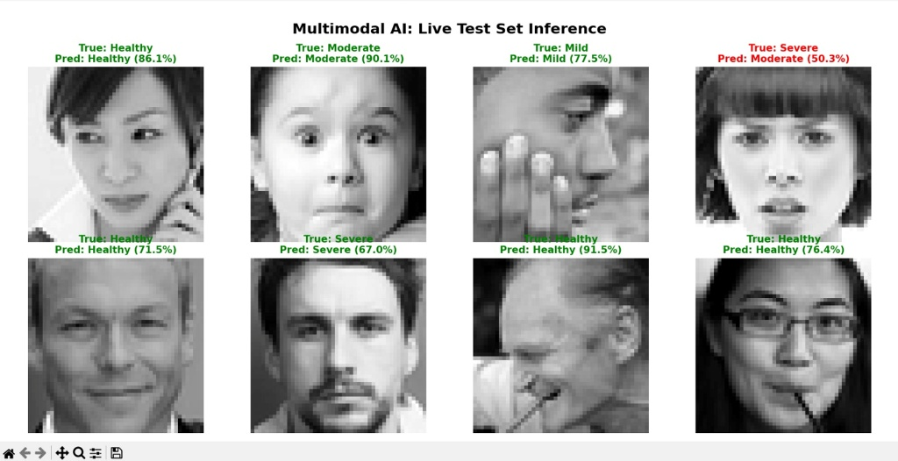

---

## Technical Pivot: Local-First Design

An initial attempt was made to deploy this application as a hosted web service using Streamlit Cloud. Infrastructure constraints made this approach unworkable for a system with these requirements:

1. **Hardware bindings:** headless cloud containers do not provide the native device access required for real-time OpenCV webcam capture.
2. **Binary dependencies:** spectral processing via Librosa failed due to the absence of underlying system libraries (`libsndfile`) in managed web environments.
3. **State latency:** real-time synchronization of high-frequency behavioral telemetry was unreliable across the cloud-client boundary.

Rather than implement a fallback with mocked or simulated logic to present a working web UI, the cloud deployment was deliberately deprecated in favor of a local runtime. This decision prioritized scientific integrity and full code transparency, ensuring every reported result reflects genuine model inference.

---

## File Structure

```text
multimodal-psych-ai/
│
├── src/
│   ├── generate_eval_plots.py
│   ├── gui_app.py
│   ├── live_demo.py
│   ├── models.py
│   ├── predict.py
│   ├── telemetry.py
│   ├── train.py
│   ├── utils.py
│   └── visualize_batch.py
│
├── assets/
│   ├── architecture_diagram.png
│   ├── evaluation_metrics_terminal.png
│   ├── ablation_study_terminal.png
│   ├── classification_performance.png
│   ├── severity_regression_r2.png
│   ├── class_distribution.png
│   ├── correlation_heatmap.png
│   ├── clinical_dashboard.png
│   ├── live_monitor.png
│   ├── inference_grid_1.png
│   ├── inference_grid_2.png
│   └── inference_grid_3.png
│
├── psych_model_weights.pth
├── requirements.txt
├── .gitignore
└── README.md
```

## Installation and Local Execution

Requires Python 3.10 or later, and a local environment capable of compiling PyTorch and OpenCV.

**1. Clone the repository**

```bash
git clone https://github.com/ReejuBanerjee/multimodal_psych_ai.git
cd multimodal_psych_ai
```

**2. Install dependencies**

```bash
pip install -r requirements.txt
```

**3. Run the clinical dashboard**

```bash
cd src
python gui_app.py
```

**4. Run live evaluation metrics**

```bash
python evaluate.py
```

---

## Future Scope

While the current model achieves a macro F1-score of 0.9444, unconstrained live inference occasionally reveals a predictive bias toward the majority Healthy class. Planned improvements include:

- **Loss function redesign:** implementing focal loss to more aggressively penalize misclassifications in minority classes (Moderate, Severe).
- **Data rebalancing:** applying SMOTE and weighted dataset oversampling to counteract the natural clinical baseline distribution.
- **Temporal integration:** transitioning from point-in-time CNN feature extraction to recurrent temporal analysis (for example, LSTMs) to better capture the evolving nature of psychological states over time.

## Additional Resources

- [Full Code Documentation (Word)](docs/Code_Documentation.docx)
- [Hackathon Presentation (PPTX)](docs/Hackathon_Presentation.pptx)